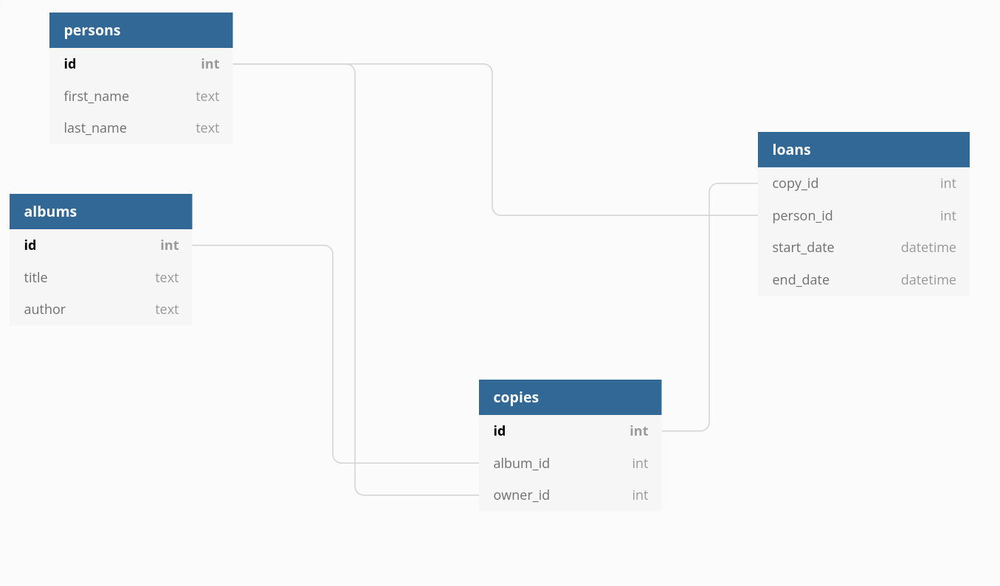

# kapernikov-inerview
## Exercise 1: Docker


For this exercise, I was asked to create a docker compose setup with 3 services:
- A jupyter server with  pandas and matplotlib and sqlalchemy and psycopg2 installed
- A postgres instance
- A pgadmin instance

For the jupyter notebook, since it needed some dependencies, I create a Dockerfile with the [jupyter/scipy-notebook](https://hub.docker.com/r/jupyter/scipy-notebook/dockerfile) 
```dockerfile
FROM jupyter/scipy-notebook

COPY requirements.txt requirements.txt
RUN python -m pip install --upgrade pip
RUN pip install -r requirements.txt
```

Then I created the docker-compose.yml, providing a port bind on 10000 to 8888 to access the jupyter notebook, and 8080 to 80 to access the pgadmin interface in my browser. 
```dockerfile
version: "3.9"
services:
  jupyter-server:
    build: .
    ports:
      - "10000:8888"
  postgres-server:
    image: "postgres:13"
    environment:
      POSTGRES_USER: dej 
      POSTGRES_PASSWORD: dej 
      POSTGRES_DB: dej

  pgadmin-server:
    image: "dpage/pgadmin4"
    environment:
      PGADMIN_DEFAULT_EMAIL: dej@gmail.com
      PGADMIN_DEFAULT_PASSWORD: dej
      PGADMIN_LISTEN_PORT: 80
    ports:
      - "8080:80"

```
After that I just use the psycopg2 module t verify I could access the postgres instance.
```python
import psycopg2
connection = psycopg2.connect(user="dej",
                                  password="dej",
                                  host="postgres-server",
                                  port="5432",
                                  database="dej")
```
## Exercise 2: Working with SQL

To create the database I went on [dbdiagram.io](https://www.dbdiagram.io) to draw the entity relationship diagram and export the DDL in postgres.

So I could just execute the script in pgadmin:
```sql
CREATE TABLE "persons" (
  "id" SERIAL PRIMARY KEY,
  "first_name" text,
  "last_name" text
);

CREATE TABLE "albums" (
  "id" SERIAL PRIMARY KEY,
  "title" text,
  "author" text
);

CREATE TABLE "copies" (
  "id" SERIAL PRIMARY KEY,
  "album_id" int NOT NULL,
  "owner_id" int
);

CREATE TABLE "loans" (
  "copy_id" int NOT NULL,
  "person_id" int NOT NULL,
  "start_date" datetime,
  "end_end" datetime
);

ALTER TABLE "copies" ADD FOREIGN KEY ("album_id") REFERENCES "albums" ("id");

ALTER TABLE "copies" ADD FOREIGN KEY ("owner_id") REFERENCES "persons" ("id");

ALTER TABLE "loans" ADD FOREIGN KEY ("copy_id") REFERENCES "copies" ("id");

ALTER TABLE "loans" ADD FOREIGN KEY ("person_id") REFERENCES "persons" ("id");

```
To insert data in the database, I use a python script which makes it more easy. As it is many lines of bottleneck code, you can see it [here](exos1_2/insertion_in_tables.ipynb)

For the queries to execute, you have the results in screenshots, but the SQL code is here:
- give all copies of a certain owner:
```sql
SELECT *
FROM copies
WHERE owner_id=1
```
- give all copies that have already been loaned more than once:
```sql
SELECT copies.id, count(*) AS total_loans
FROM copies
JOIN loans
ON copies.id = loans.copy_id
GROUP BY copies.id
HAVING count(*) > 1
```
- give all copies that have been loaned for more than a week:
```sql
SELECT DISTINCT copies.id
FROM copies
JOIN loans
ON copies.id = loans.copy_id
WHERE (end_date - start_date) > 7
```
- Give all albums that do not have a copy that has already been loaned:
```sql
SELECT albums.id
FROM albums
WHERE id NOT IN (
	SELECT Al.id
	FROM albums AS Al
	JOIN copies AS Co
	ON Al.id = Co.album_id
	JOIN loans AS L
	ON Co.id = L.copy_id
);
```
- To prevent to a double loan for a single copy et the same time, I write a trigger function:
```sql
CREATE OR REPLACE FUNCTION public.prevent_double_loans()
    RETURNS trigger
    LANGUAGE 'plpgsql'
    VOLATILE
    COST 100
AS $BODY$
BEGIN
   IF (SELECT MIN(l.end_date) FROM "loans" l WHERE l.copy_id = NEW.copy_id)
    > (NEW.start_date) THEN
      RAISE EXCEPTION 'You cant loan a copy two time ';
   END IF;
   RETURN NEW;
END
$BODY$;

CREATE TRIGGER check_double_loan
BEFORE INSERT ON loans
FOR EACH ROW EXECUTE PROCEDURE prevent_double_loans();
```

## Exercise 3: LIDAR processing

All the prcess is in this [notebook](exo3/lidar_processing.ipynb)


